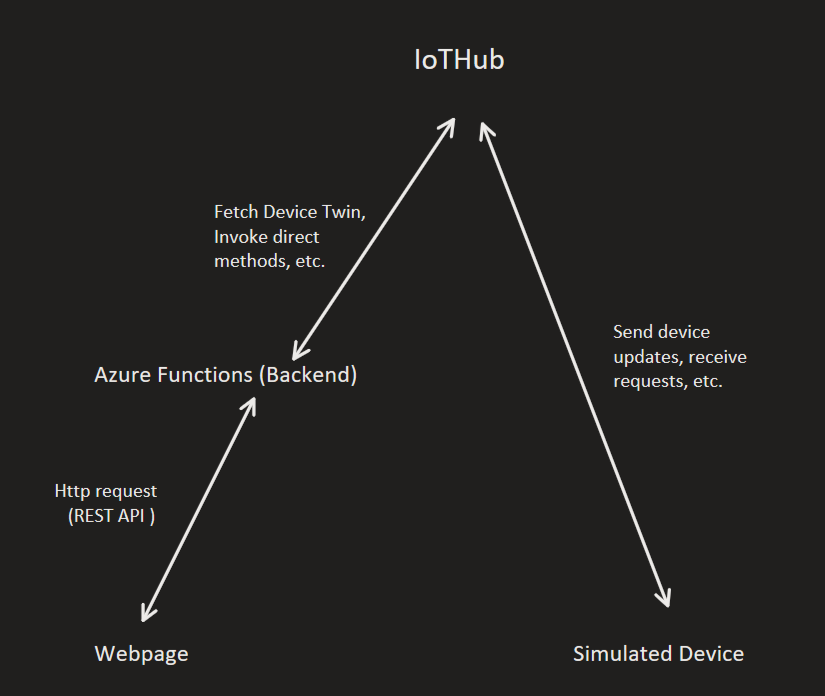
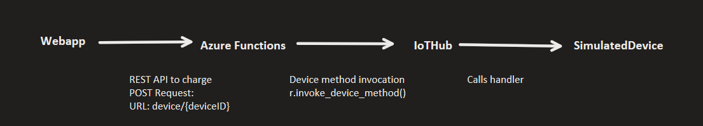

# Simulated Car Charge 
A whole simulated car charging demo providing car information and car charging capabilities in a webapp, and a simulated car implemented using Python CLI, connected over Azure. 

```
Running Application
1. Go to the webapp on a browser: https://proud-grass-05bcea900.6.azurestaticapps.net/
2. Assign an environment variable: IOTHUB_DEVICE_CONNECTION_STRING = CONNECTION_STRING  # Need to ask me directly for the connection string
3. Run 'python SimulatedDevice.py' or 'python SimulatedDevice.py -r True' to reset device.
```


The following entities are involved:
- WebApp: displays information about the simulated car with start and stop charging functions.
- Azure Functions: A backend receiving HTTP requests and communicating with the Azure IoTHub.
- IoTHub: A hub for Internet of Things (IoT) connecting devices.
- SimulatedDevice: A simulated car CLI.





## WebApp Requests
The user pressing the start charging button shows one of the flows from the WebApp to the SimulatedDevice. 





## Tools
The following tools were used:
- HTML/JavaScript for WebApp
- Azure IoTHub, Functions, Static Web App for Cloud 
- Python programming language for implementing Azure Functions and SimulatedDevice CLI
